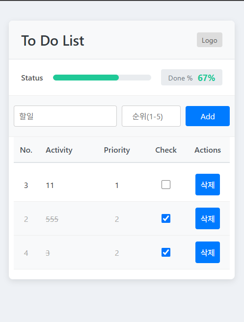

# To-Do List App

이 프로젝트는 HTML, CSS, JavaScript를 사용하여 만든 간단한 웹 기반 할 일 목록(To-Do List) 애플리케이션입니다.

## 스크린샷

## 기능 구현 내역

프로젝트 개발 중 다음과 같은 기능들이 구현 및 수정되었습니다:

1.  **기본 메모 앱 구조 생성:**
    *   `index.html`, `style.css`, `script.js` 파일 생성.
    *   메모 추가, 표시, 삭제 기능 구현.
    *   로컬 저장소(LocalStorage)를 사용한 메모 데이터 저장 및 로드.

2.  **메모 앱 기능 개선:**
    *   메모 추가 시 생성 시간 표시 기능 추가.
    *   기본 `confirm()` 대신 커스텀 디자인의 삭제 확인 모달 창 구현.

3.  **디자인 변경 (To-Do List 테마 적용):**
    *   참고 이미지를 기반으로 전체적인 레이아웃 및 디자인 변경 (HTML 구조 및 CSS 대폭 수정).
    *   헤더, 진행률 표시줄, 테이블 형태의 리스트(No., Activity, Priority, Check, Actions 컬럼) 구조 도입.
    *   Activity 및 Priority 입력 필드 추가.

4.  **To-Do List 기능 구현:**
    *   Activity 및 Priority 입력 기능 구현.
    *   체크박스를 이용한 할 일 완료 상태 토글 기능 구현.
    *   완료된 항목 비율에 따른 진행률 표시줄 업데이트 기능 구현.
    *   항목 삭제 기능 (커스텀 모달 창 유지).
    *   로컬 저장소를 사용하여 To-Do 항목 데이터(`id`, `activity`, `priority`, `completed`) 저장 및 로드.

5.  **사용자 경험(UX) 개선:**
    *   "Activity" 및 "Priority" 헤더에 마우스 호버 시 한국어 설명 툴팁 표시 (HTML `title` 속성 사용).
    *   입력 필드 (`Activity`, `Priority`)의 `placeholder` 텍스트 한국어 및 간결화 수정.
    *   입력 유효성 검사(`alert`) 메시지 한국어 수정.
    *   입력 섹션과 리스트 헤더/항목 간의 가로 및 세로 정렬 문제 해결 (CSS Grid 레이아웃 도입 및 정렬 속성 조정).

6.  **정렬 및 시각화 기능 추가:**
    *   항목 자동 정렬 기능 구현:
        *   1순위: 완료되지 않은 항목 > 완료된 항목
        *   2순위: 우선순위(Priority) 낮은 숫자 순
        *   3순위: 먼저 추가된 항목 순
    *   완료된 항목과 미완료 항목의 시각적 구분 강화 (배경색 변경, 텍스트 회색 처리, 활동 내용 취소선).
    *   항목 번호('No.') 고정 기능 구현 (정렬 순서가 변경되어도 초기 추가 순서 유지).

7.  **Firebase Realtime Database 연동:**
    *   기존 로컬 저장소(LocalStorage) 기반 데이터 저장 방식을 Firebase Realtime Database로 전환.
    *   Firebase SDK 설정 및 초기화 (`firebase-config.js` 분리).
    *   데이터 추가, 조회(실시간), 수정(체크 상태), 삭제 로직을 Firebase 연동으로 수정.
    *   항목 번호('No.') 기능 제거 (Firebase 키를 ID로 사용).

8.  **Firebase Authentication 연동 및 페이지 구성:**
    *   Firebase Authentication (Email/Password) 연동.
    *   로그인 페이지 (`login.html`) 생성 및 로그인 기능 구현.
    *   회원가입 페이지 (`signup.html`) 생성 및 회원가입 기능 구현 (사용자 이름 포함).
    *   `index.html` 헤더에 로그인 버튼 추가 및 페이지 이동 링크 설정.
    *   로그인/회원가입 페이지 간 이동 링크 추가.

9.  **사용자별 데이터 관리 및 UI 개선:**
    *   로그인한 사용자의 고유 ID(`uid`)를 기반으로 Firebase Realtime Database 경로 분리 (`todos/{userId}`).
    *   사용자별 할 일 목록 데이터 저장 및 조회 기능 구현.
    *   로그인 상태에 따라 `index.html` 헤더 UI 동적 변경:
        *   로그인 시: 사용자 환영 메시지 및 로그아웃 버튼 표시, 로그인 버튼 숨김.
        *   로그아웃 시: 로그인 버튼 표시, 환영 메시지 및 로그아웃 버튼 숨김.
    *   로그아웃 기능 구현.
    *   로그인하지 않은 사용자가 `index.html` 접근 시 로그인 페이지로 리디렉션.

10. **로그인 기록 저장:**
    *   사용자 로그인 성공 시 Firebase Realtime Database의 `login_logs` 경로에 로그인 기록(사용자 ID, 이메일, 이름, 로그인 시간) 저장 기능 추가.

## 개발 도구

이 애플리케이션은 AI 코드 어시스턴트인 **Cursor**와 Google의 **Gemini** 모델의 도움을 받아 개발되었습니다.

## 실행 방법

1.  프로젝트 파일을 다운로드합니다.
2.  `index.html` 파일을 웹 브라우저에서 엽니다.
이제 To-Do List 앱을 사용할 수 있습니다. 